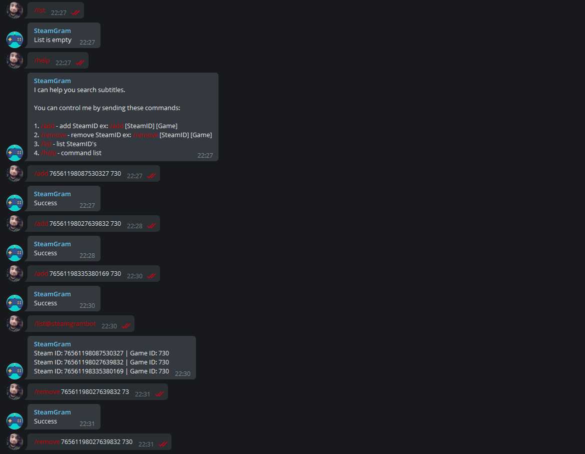
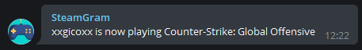

# Steamgram
Telegram bot for Steam friends notifications.

<p align="center">
  
</p>

<p align="center">
  
</p>

# Features
* /search `App ID` or `Name` - Search App
* /add `Steam ID` - Add Steam ID
* /remove `Steam ID` - Remove Steam ID
* /list - List players
* /help - Help

# Prerequisites
* [Node.js](https://nodejs.org/en/)

# Running
### 1. Configure
````
# Bot
Create and configure .env file like .env.example.
````

### 2. Telegram
````
# Create an Telegram bot
Find @BotFather on Telegram, type /newbot and follow the instructions.

# Username
Get your bot username and set 'TELEGRAM_USERNAME' in .env.

# Token
Get your token from @BotFather and set 'TELEGRAM_TOKEN' in .env.
````

### 3. Steam
````
# Configure
Get your key from https://steamcommunity.com/dev/apikey and set in .env
````

### 4. PostgreSQL
````
# Install
Install PostgreSQL and create an database.

# Configure
Set PostgreSQL 'POSTGRESQL_USERNAME', 'POSTGRESQL_PASSWORD', 'POSTGRESQL_DATABASE', 'POSTGRESQL_HOST' and 'POSTGRESQL_DIALECT' in .env.
````

### 5. Run
````
# Install dependencies
npm install

# Create tables
npm run migrate

# Seed apps table
npm run seed

# Start
npm start
````

# Built With
* [Node.js](https://nodejs.org/en/)

# Authors
* [xxgicoxx](https://github.com/xxgicoxx)

# Acknowledgments
* [FlatIcon](https://www.flaticon.com/)